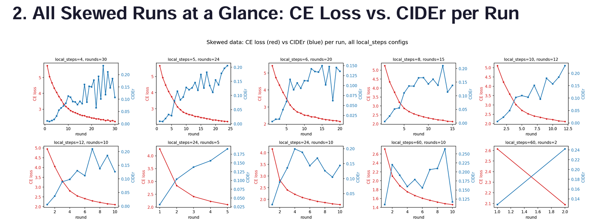
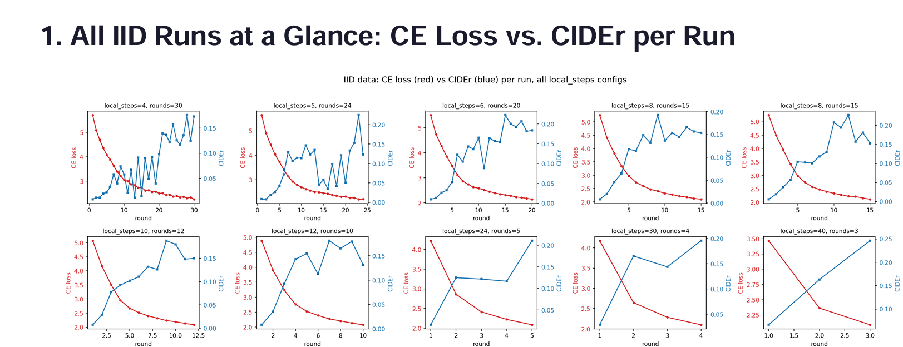

# Federated Learning VLM Aggregation Understanding

Understanding how a vision-language model behaves under **FedAvg** when you vary
**how often clients synchronize** (`local_steps`) while holding the **total amount
of local training fixed** (`local_steps × rounds = constant`). The model is
`microsoft/Florence-2-base`, fine-tuned with LoRA for detailed chest X-ray
caption generation on the Indiana University Chest X-rays dataset, split
across 3 simulated clients.

This repo is both the code and the experiment: `FL_LocalSteps_Analysis_Report.pdf`
is the write-up of what came out of running it, and `final_reslts.zip` is the
raw per-run JSON behind every chart in that report.

---

## What's being studied

In FedAvg, each round looks like:

```
for each client:
    train locally for some amount of local computation
send weights back → average them (FedAvg) → new global model
repeat for N rounds
```

**`local_steps`** controls *how much local computation happens per client
before that sync* — low `local_steps` means frequent aggregation (many
rounds, little local work each time), high `local_steps` means infrequent
aggregation (few rounds, a lot of local work each time). One full pass over
a client's own dataset is not required — `local_steps` decouples "how much a
client trains" from "how much data a client owns," so it can be swept
independently.

The central question: **does the amount of local computation between syncs
change caption quality, and does that answer change when clients hold
different amounts of data?**

Two data regimes are compared:
- **IID** — clients get a near-uniform Dirichlet split (`--dirichlet_alpha`
  high, e.g. 100).
- **Skewed** — clients get deliberately unequal amounts of data via
  `--client_ratios` (e.g. `10,25,65`).

> **Important scope note:** the skew produced here is **sample-count
> imbalance only** — one client simply has less data than another, but all
> clients still see a statistically similar mix of cases. This is *not*
> label/content heterogeneity (e.g. one client seeing mostly one diagnosis
> category). That distinction matters for how to read the "skewed" results
> below — see [Limitations](#limitations--open-questions).

---

## Pipeline — run in this order

### 1. Download the data — `indiana_university.py`
Downloads the Indiana University Chest X-rays dataset (`raddar/chest-xrays-indiana-university`
on Kaggle, ~14 GB) with a progress bar.

**Setup:** create a `.env` file (never commit this) next to the script:
```
KAGGLE_API_TOKEN=KGAT_your_token_here
```
Get the token from Kaggle → Account → API. Authentication uses a Bearer
token, not the older `kaggle.json` username/key scheme.

```bash
python indiana_university.py
```

Downloads and extracts into an `OUTPUT_FOLDER` (edit the path at the top of
the script to point at your own scratch/data directory).

### 2. Prepare `data/images/` + `data/annotations/annotations.jsonl`
`federated_split.py` (next step) expects a clean `data/` folder in this shape:
```
data/
    images/
        CXR1_1_IM-0001-3001.png
        ...
    annotations/
        annotations.jsonl   # one JSON object per line: {"image": "<filename>", "suffix": "<caption>"}
```
to change it 
```
python format_json.py
```
The raw Kaggle download needs to be converted into this format (image
filenames + one caption per image) before moving on. This repo doesn't
include that conversion step — adapt it to whatever structure the raw
Indiana University data lands in on your machine, matching the JSONL schema
above.

### 3. Split into federated clients — `federated_split.py`
Takes `data/` and produces `data/fed_input_data/` with one folder per client
plus a held-out `test_data/` folder (20% by default).

```bash
# IID-ish split (near-uniform)
python federated_split.py --data_dir ./data --alpha 100 --dirichlet_alpha 100

# Skewed split — explicit, deterministic client sizes
python federated_split.py --data_dir ./data --alpha 100 --client_ratios 10,25,65
```

Key flags:

| Flag | What it does |
|---|---|
| `--alpha` | % of the labeled dataset to use at all (100 = full data; lower for quick smoke tests) |
| `--dirichlet_alpha` | Dirichlet concentration controlling **sample-count** imbalance across clients. Higher (e.g. 100) → near-uniform. Lower (e.g. 0.5) → more skewed counts. Ignored if `--client_ratios` is set. |
| `--client_ratios` | Comma-separated exact percentages per client (e.g. `10,25,65`), must sum to 100. Deterministic — overrides `--dirichlet_alpha` entirely. |
| `--num_clients` | Number of clients (default 3) |
| `--seed` | Random seed for the shuffle/split |

Writes `split_summary.json` alongside the client folders recording exactly
which mode and parameters produced that split.

### 4. Train — `florence_fed_captioning.py`
Runs the actual FedAvg loop: LoRA fine-tunes `Florence-2-base` (fp16, no
quantization) across the clients produced by step 3, aggregating every
`--rounds` × `--local_steps` schedule you specify.

```bash
python florence_fed_captioning.py --local_steps 12 --rounds 10
```

Key flags:

| Flag | What it does |
|---|---|
| `--local_steps` | Local optimizer steps per client per round — the aggregation-frequency knob. Omit to fall back to `--local_epochs` (one full local epoch per round, old-style behavior). |
| `--rounds` | Total FL rounds = total aggregation events |
| `--data_dir` | Path to `fed_input_data/` from step 3 |
| `--output_dir` | Where `Output/run_<timestamp>/` gets written |

**To sweep aggregation frequency at a fixed total training budget** (what
this study does — `local_steps × rounds = 120` for most runs):
```bash
for steps in 4 5 6 8 10 12 24 30 40; do
    rounds=$((120 / steps))
    python florence_fed_captioning.py --local_steps $steps --rounds $rounds
done
```

Each run produces `Output/run_<timestamp>/`:
```
run_config.json          # every hyperparameter for this run
training.log
model_checkpoints/best/  # LoRA checkpoint with the highest CIDEr seen during training
scores/
    round_metrics.csv    # per-round: aggregated + per-client CE loss, BLEU/METEOR/ROUGE-L/CIDEr
    final_results.json   # summary + best_round/best_cider + full per-round history
    client_losses.png
    aggregated_loss.png
    combined_loss.png
```
Plotting logic lives separately in `utils/metrics_plotting.py` and is
imported by the training script rather than duplicated inline.

Model is plain **FedAvg** — no FedProx/proximal term (`mu`) in this codebase.
See [Limitations](#limitations--open-questions).

---

## Results — `final_reslts.zip` and the PDF report

`final_reslts.zip` contains the `final_results.json` for every run behind
this study: 9 IID runs and 8 skewed runs at the shared 120-step budget
(covering `local_steps` ∈ {4, 5, 6, 8, 10, 12, 24, 30, 40, 60}, with a couple
of duplicate seeds), plus 2 skewed runs deliberately extended well past the
120-step budget (to 240 and 600 total steps) to study what happens with
excess local training.


**`FL_LocalSteps_Analysis_Report.pdf`** is the full write-up — 10 sections
of plots plus a summary. Condensed version:




- **Loss is a smooth, well-behaved training signal; CIDEr is noisy.** In
  every single run, aggregated CE loss falls monotonically round over round.
  CIDEr does not — it climbs with real round-to-round volatility, more so
  under the skewed split than IID.
- **Under a fixed budget, CE loss is almost insensitive to `local_steps`.**
  Loss-vs-cumulative-steps curves collapse onto essentially one shared
  trajectory regardless of aggregation frequency, in both data regimes.
- **CIDEr does not collapse onto one curve — `local_steps` visibly matters
  here, and the effect reverses between regimes.** Under IID, higher
  `local_steps` traced smoother, higher-reaching CIDEr paths. Under skew,
  the ranking reshuffles substantially — e.g. `local_steps=6` scores 0.222
  under IID but only 0.150 under skew, the largest single gap found.
  **No single `local_steps` value is "best" across both regimes.**
- **Extending training past the budget produces unambiguous overfitting —
  visible only in CIDEr, never in loss.** In both extended skewed runs, CE
  loss kept improving smoothly to the very last round while CIDEr peaked
  early and then collapsed (in the most extreme case, from 0.264 to 0.118 —
  more than half its value — in a single additional round).
  **Checkpoint selection must be driven by CIDEr (or another downstream
  metric), never by loss.**
- **The client-divergence proxy (std of per-client CE loss) was
  inconclusive on whether infrequent aggregation increases client drift** —
  the fixed-budget design confounds `local_steps` with how far into training
  each measurement lands, so this couldn't be cleanly isolated here.
- **Practical recommendation:** a moderate `local_steps` range (roughly
  5–10) was the most robust operating point across both regimes — enough
  rounds to reliably catch the true CIDEr peak before it passes, and
  competitively (if not always optimally) placed in both IID and skewed
  comparisons, rather than excelling in one regime and underperforming in
  the other.

---

## Limitations & open questions

- **The "skewed" split here is sample-count imbalance, not label/content
  heterogeneity.** `federated_split.py`'s Dirichlet and ratio splits both
  operate on raw sample indices, with no category/diagnosis field to skew
  by. The classic FL "client drift from non-IID data" phenomenon is
  typically driven by label-distribution skew — this repo has not yet
  tested that regime.
- **No FedProx.** The proximal term (`mu`) that's designed specifically to
  counteract client drift was intentionally left out of this codebase to
  isolate `local_steps` as a clean variable. Revisiting `local_steps × mu`
  jointly is a natural next step.
- **Mostly single-seed runs.** Duplicate-seed runs at the same config showed
  up to ~0.01–0.04 CIDEr spread from randomness alone; some effects reported
  above (e.g. the `local_steps=6` IID-vs-skewed gap) exceed that noise floor,
  but most configurations were only run once.
- **Per-round CIDEr is computed on a 200-sample subset**, not the full test
  set, during training (the full-test-set number is only computed once, on
  the final best checkpoint) — this is part of why the CIDEr curves are
  noisier than the loss curves.
- **Whether infrequent aggregation genuinely increases client drift remains
  open.** A cleaner follow-up would fix the number of rounds and vary
  `local_steps` (letting total budget vary), or sample the client-divergence
  metric at matched cumulative-step checkpoints rather than at round
  boundaries.

---

## Setup

```bash
pip install -r requirements.txt --break-system-packages   # if on a restricted/managed Python env
```

Trains via LoRA + fp16 (no quantization) — has been run on Tesla P100/V100
and A100 GPUs. Requires the Kaggle API token described in step 1.
